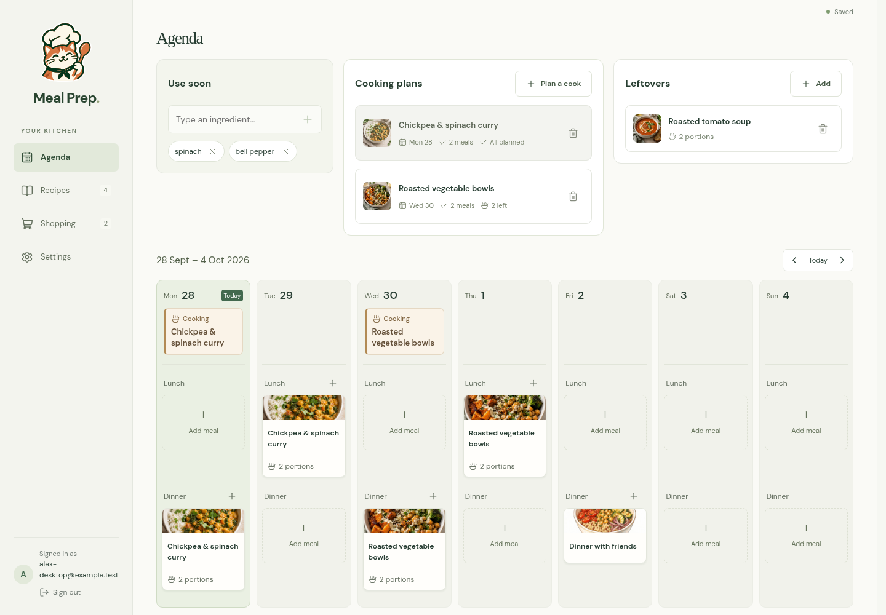
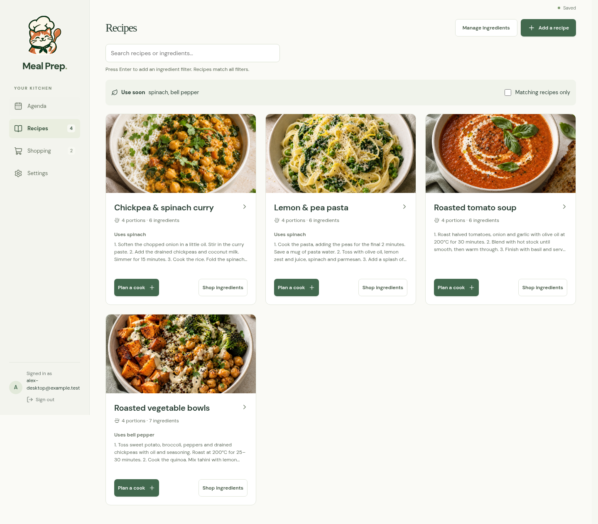
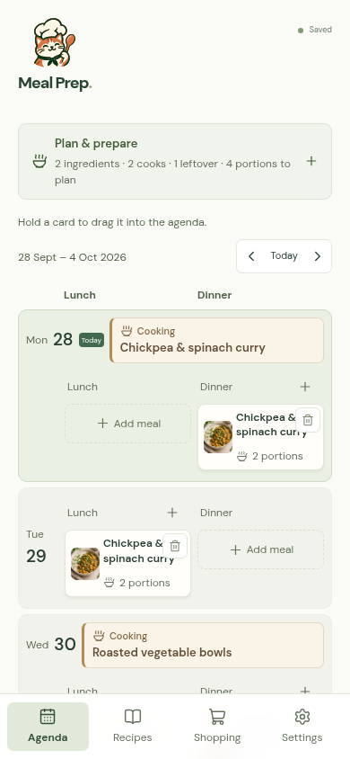

# Meal Prep

Meal Prep 0.1.0 is a self-hosted meal planner for a shared household. Keep recipes for inspiration, plan cooking and meals, use leftovers, and share a shopping list. The interface supports English and German.



<details>
<summary>Recipes and mobile planning</summary>





</details>

Screenshots use fictional example data. New households start empty.

See the [changelog](CHANGELOG.md) for release notes.

## Run locally

Use Node 24 or 26:

```sh
npm ci
cp .env.example .env
npm run dev
```

Open http://127.0.0.1:5174. The development command reads `.env`. With `MAIL_DELIVERY=console`, sign-in codes appear in the server terminal; no email is sent. Codes expire after five minutes. Sign in and create a household, or open an invitation link to join one. New households start empty.

To test from another device, set `BETTER_AUTH_URL` to the address that device will open, then bind the server to that address:

```sh
npm run dev -- --host YOUR_LOCAL_IP
```

Share the requested code from the server terminal with the tester. The test-only inbox endpoint is unavailable during normal development and production.

## Planning

- **Agenda:** choose any planning horizon in Settings. Arrows move the view one day; Today returns to your preferred starting day. Changing the view never removes meals.
- **Cooking plans:** choose a recipe or name a dish, set its cooking day and portions, then place meals in the agenda. A cook opened from a meal slot also places that first meal. Dragging shows unavailable dates before a move; cooking cannot move after meals that depend on it.
- **Leftovers:** record prepared food and reserve its portions by placing meals. Removing a cooking plan or leftovers asks what to do with linked meals. Fully planned leftovers leave the preparation board when their meals leave the visible range.
- **Use soon:** list ingredients that need using. Recipe suggestions use ingredient identities and aliases. Manage these in Recipes; alternative spellings can be merged without translating anyone’s content.
- **Recipes:** save names, ingredients, optional notes, uploaded photos, or illustrated category images. Recipes remain available as the agenda moves forward.
- **Shopping:** add items directly or from a cooking plan. Batch size scales generated quantities; manually edited or removed shopping lines stay respected. Quantities are not automatically converted or aggregated.

Drag cards on desktop, long-press and drag on a phone, or choose food through a meal slot. Keyboard users can move focused cards with Alt and arrow keys. Undo restores recent changes.

Settings controls the starting day, number of days, default portions, and enabled meal sections. Lunch and Dinner start enabled; Breakfast and custom sections can be enabled, renamed, and reordered. Disabling a section preserves its existing meals.

## Accounts, households, and language

Everyone in a household can plan meals and edit recipes. Owners manage the household name, membership, and invitations. A household can have multiple owners, but at least one must remain. Invite links are single-use, valid for seven days, and individually revocable. Generating a link does not send an email; share it yourself. An account belongs to one household at a time.

**Settings → Language** changes only your interface. English and German are also available before sign-in. Browser language supplies the initial default, with English as fallback. A choice made while signed in is saved to the account; a cookie remembers the pre-login language. Dates, counts, built-in section labels, and sign-in emails are localized. Recipes, ingredients, notes, household names, and custom or renamed sections stay as written.

## Saving and backups

**Saved** means the current edits reached the server. Household changes are checked automatically while the app is open. Independent edits are merged; overlapping edits require a decision rather than silently replacing someone’s work. Unsaved changes have a per-user, per-household, per-tab recovery copy when browser storage is available. This recovery copy is not a backup.

If saving fails, keep the tab open and use **Retry**. Conflicting edits can be downloaded before loading the saved plan. Wait for **Saved**, or download pending edits, before closing the tab.

Private storage defaults to `data/`:

- `accounts.sqlite`: authentication and sessions.
- `households.sqlite`: membership, invitations, and personal language preferences.
- `households/<id>/plan.sqlite`: the household plan.
- `households/<id>/photos/`: uploaded recipe and meal photos.

`MEAL_PREP_DB_PATH` sets the base database path; its parent directory contains the household storage. Keep the whole directory private and on persistent storage. Uploads are resized to at most 1200 pixels and stored as JPEGs. Replaced images are retained for Undo and existing references.

For a backup, wait for saves to finish, stop the app, and copy the **whole storage directory**, including any SQLite `-wal` and `-shm` files. Restore with the app stopped and browser tabs closed, then restart. Existing document formats are upgraded when loaded; never delete a database to resolve a migration error.

## Hosting and email

1. Configure an SMTP provider and verify its sender domain.
2. Set `MAIL_DELIVERY=smtp`, `MAIL_FROM`, and the `SMTP_*` settings from `.env.example`. Port 587 uses STARTTLS; port 465 uses `SMTP_SECURE=true`.
3. Set `BETTER_AUTH_URL` and `ORIGIN` to the same public HTTPS origin. Set a persistent `BETTER_AUTH_SECRET` with at least 32 random characters.
4. Build and run behind an HTTPS reverse proxy with persistent private storage:

```sh
npm run build
HOST=127.0.0.1 PORT=3000 node --env-file=.env build
```

Production requires HTTPS configuration, an authentication secret, and SMTP; it never falls back to console delivery. Codes expire after five minutes and allow five attempts. Sessions last up to 30 days and renew with use. Access to plans and photos checks household membership on every request.

Configure the reverse proxy’s trusted client-address handling so rate limits identify the actual client. See [adapter-node configuration](https://svelte.dev/docs/kit/adapter-node#Environment-variables-ADDRESS_HEADER-and-XFF_DEPTH).

## Development

```sh
npm run check         # Svelte and TypeScript
npm test              # Planning, persistence, compatibility, and translations
npm run test:ui       # Current app: desktop and phone, isolated temporary database
npm run format:check
npm run build
```

Browser tests use `/usr/bin/chromium` when available. Otherwise install Chromium with `npx playwright install chromium`, or set `PLAYWRIGHT_CHROMIUM_EXECUTABLE`. Tests start their own server on port 4173; keep that port free. Sample plans belong in `tests/fixtures`, never in application startup.

The main page coordinates planning, with focused editors and screens in `src/lib/components`. Shared planning logic lives in `src/lib`, server persistence and authentication in `src/lib/server`, and planner styles in `src/lib/styles`. Saved-data compatibility remains covered by tests even though the original calendar UI has been removed. Final artwork sources and reusable style guidance live in `design`; runtime assets live in `static/images`.

For notable user-visible changes, add an entry under **Unreleased** in [CHANGELOG.md](CHANGELOG.md), grouped as Added, Changed, Deprecated, Removed, Fixed, or Security. At release time, move those entries into a dated version section and update the comparison links.

Translations live in `src/lib/i18n/en.json` and `de.json`, organized with feature-prefixed keys. Use `useI18n()` and whole ICU messages with placeholders and plurals. Use locale-aware date and number formatting; do not translate stored household content. To add a language, register its catalog, native name, and formatting locale in `messages.ts`. Tests check matching keys and interpolation arguments. Check new translations on narrow screens as well as desktop.

This release intentionally avoids full pantry inventory and automatic scheduling. Plans are stored as a single size-limited document; meal timing and portion checks support planning, not food-safety decisions.

## License

Copyright © 2026 Maximilian Schmidt.

Meal Prep is licensed under the [GNU Affero General Public License version 3 only](LICENSE) (`AGPL-3.0-only`). This covers the project's code, documentation, and bundled original artwork, including the cat-chef logo, food images, and illustrations. Third-party dependencies, fonts, and icons retain their respective licenses. User-created household content is not licensed by this repository.

Commercial use is allowed. If you run a modified version as a network service, you must offer its corresponding source code to users under the AGPLv3; see the license for the full terms.
